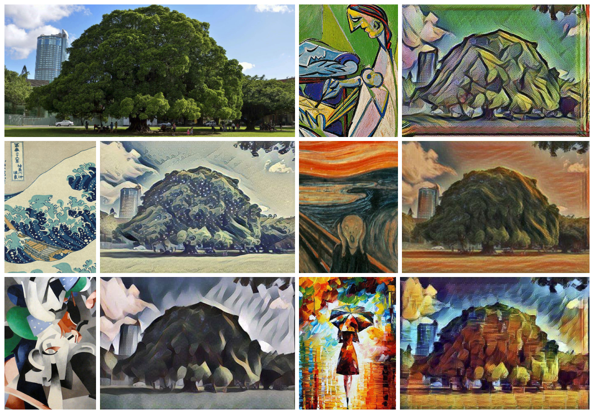

# Project Odin
## What is Project Odin ?
**Project Odin** is a Facebook Chatbot that can do **Neural Style Transfer**

## What is Neural Style Transfer ?
Neural Style Transfer is an algorithm using **Deep Learning** to **"repaint"** an image to a given style.
### Given Image

### Repainted Images

## Reference
[A Neural Algorithm of Artistic Style](https://arxiv.org/pdf/1508.06576.pdf)
