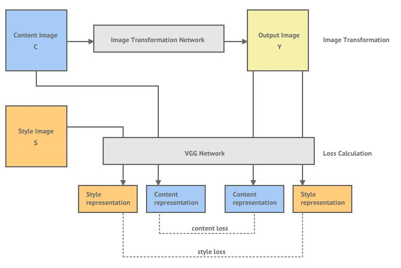
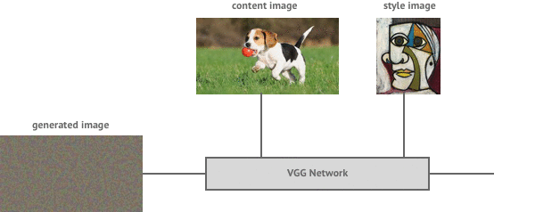
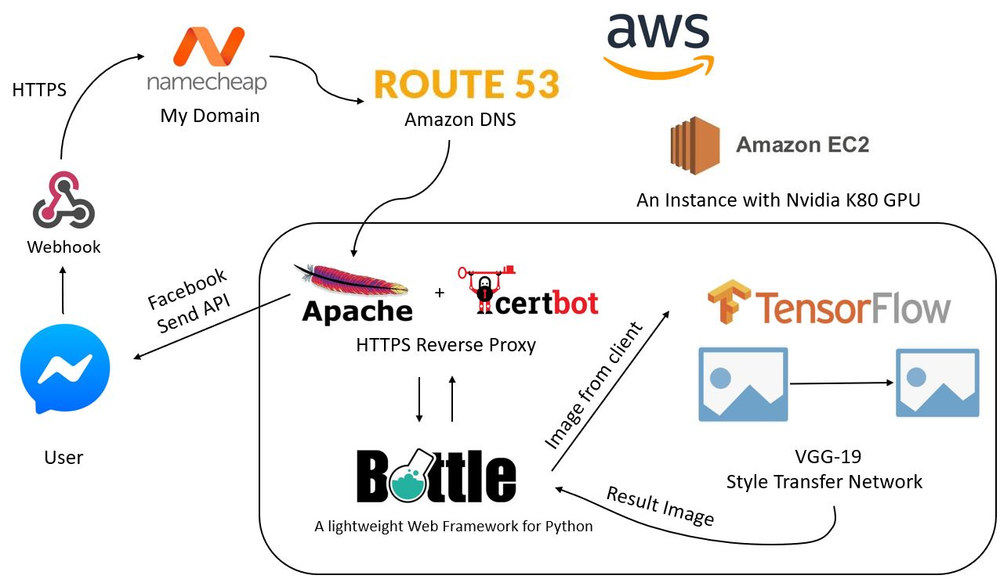
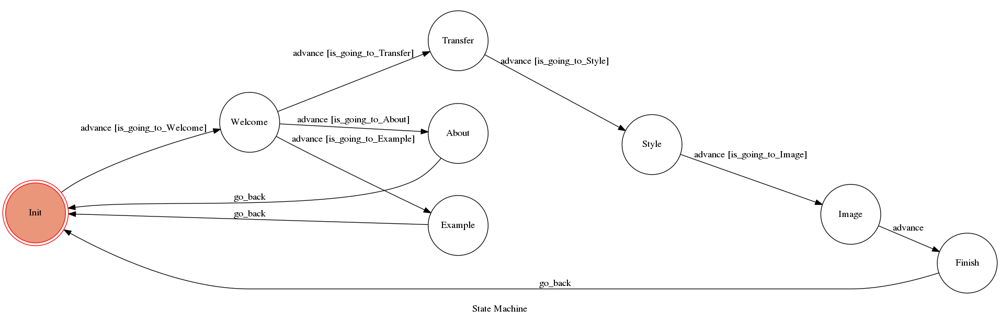

# Project Odin
## What is Project Odin ?
**Project Odin** is a Facebook Chatbot that can do **Neural Style Transfer**

## What is Neural Style Transfer ?
Neural Style Transfer is an algorithm using **Deep Learning Model** to **"repaint"** an image refer to a given style.

### [Watch demo videos on YouTube!](https://www.youtube.com/playlist?list=PLyrtJ1CjyyOPmKlV7Yck4STTHBChEGosH)

## Neural Style Transfer System

## Image Generation

## System Framework

## FSM Graph

### States
- Init : Initial state
- Welcome : Send Welcome template to user
- Transfer : Send Style images to user
- Style : Ask user to upload an image
- Image : Transfer the image
- Finish : Say goodbye to user
- Examples : Send an example template to user
- About : Send a link to this repo to user

### Conditions

## Reference
- Great Explanation of [Artistic Style Transfer with Deep Neural Networks](https://shafeentejani.github.io/2016-12-27/style-transfer/)
- Original Paper : [A Neural Algorithm of Artistic Style](https://arxiv.org/pdf/1508.06576.pdf)
